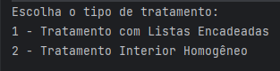
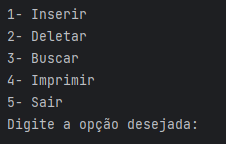
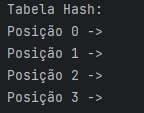
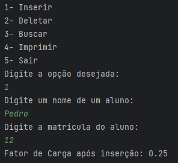
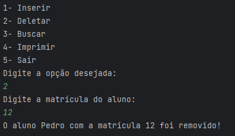
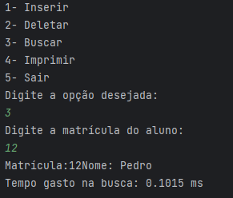

<h1 align="center">Tabela Hash</h1>

Este projeto consiste em uma implementação de tabela hash em Java com duas estratégias diferentes: Encadeamento com Listas Encadeadas e Encadeamento Interior Homogêneo. O objetivo principal da tabela hash é armazenar informações sobre alunos, usando a matrícula como chave para indexar os alunos.

 
<h2 align="center">Como usar?</h2>

1- Clone esse repositório para sua máquina local

2- Abra o projeto em seu ambiente de desenvolvimento Java.

3- Execute o arquivo Main.java para executar o programa.

 
<h2 align="center">Como funciona o código?<h2>

Ao rodar o código, irá aparecer a opção de escolher qual tratamento de colisão você deseja usar:

Após escolher a forma de tratamento, você tem que escolher o tamanho da tabela e depois irá aparecer um menu com as opções disponíveis pra tabela:

<strong>[Opção 4] - Imprimir Tabela:</strong> Essa é a opção que recomendamos escolher primeiro, para poder ver as posições e os alunos armazenados na tabela.

<strong>[Opção 1] - Inserir:</strong> Permite adicionar um aluno à tabela hash usando a matrícula como chave.

<strong>[Opção 2] - Deletar:</strong> Permite remover um aluno da tabela hash com base na matrícula.

<strong>[Opção 3] - Buscar:</strong> Permite encontrar um aluno na tabela hash com base na matrícula e exibir informações sobre o aluno, incluindo o tempo gasto na busca.

</html>
